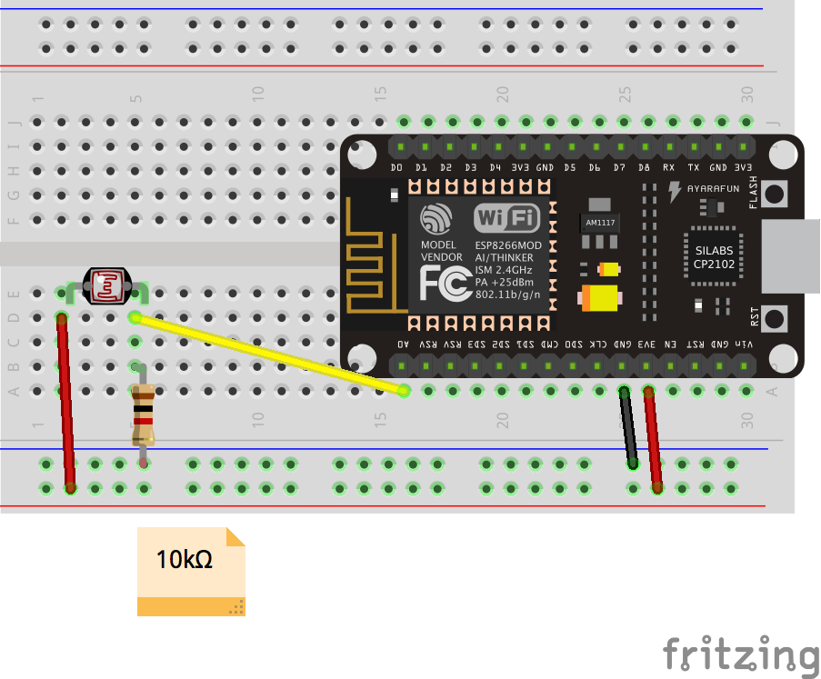
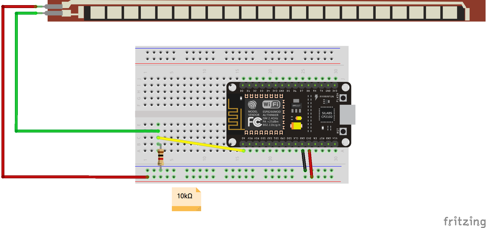
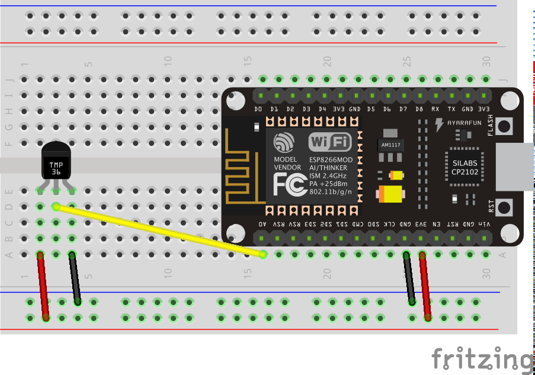
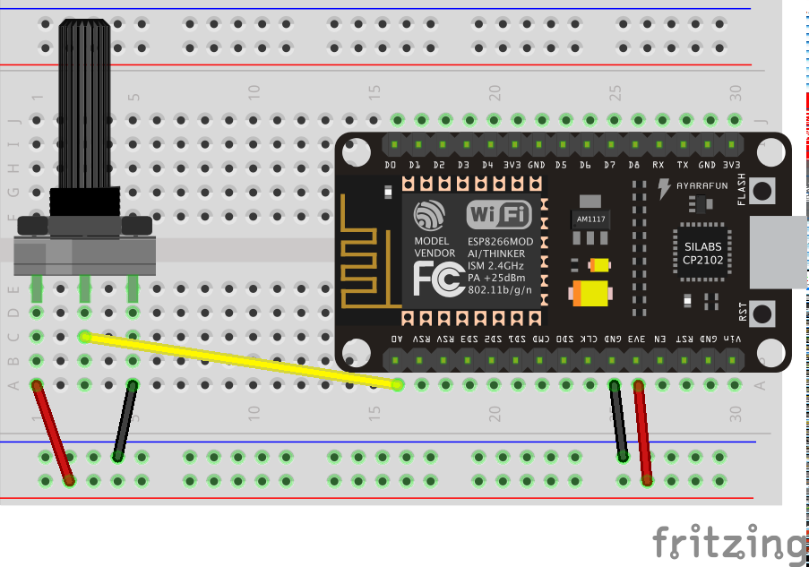
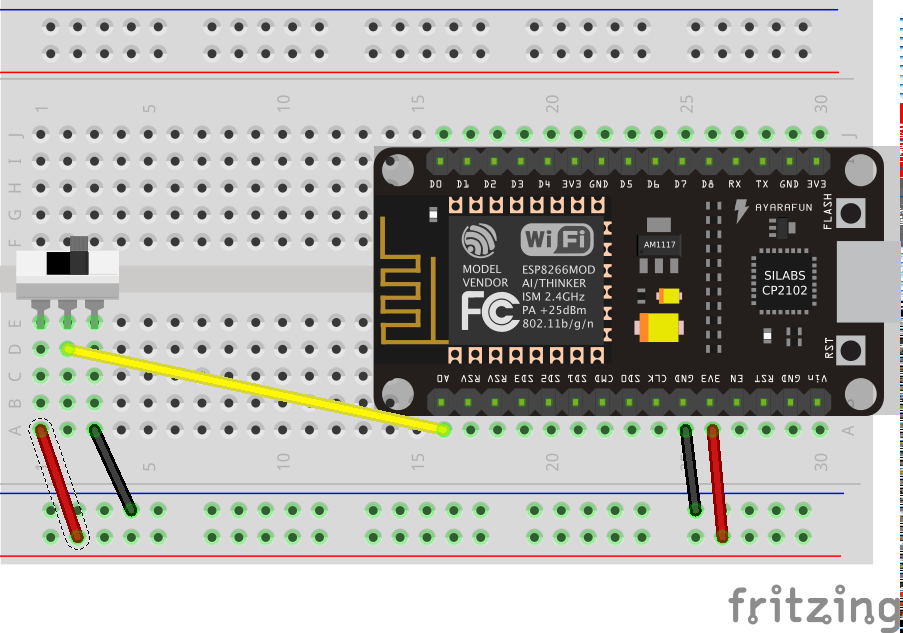

# Warsztaty IOT - Festiwal Przemiany 2017 - Centrum Nauki Kopernik

## Przygotowanie środowiska
### 1. Zainstalowanie Arduino IDE

1. Pobrać [Arduino IDE](https://www.arduino.cc/en/Main/Software) i zainstalować.

### 2. Zainstalowanie obsługi modułów ESP8266
1.  Wejść do Ustawień Arduino IDE (File -> Preferences) i dodać link `http://arduino.esp8266.com/stable/package_esp8266com_index.json`
w polu Additional Boards Manager URLs

2. Wejść do managera płytek (Tools -> Boards -> Boards Manger, wyszukać i zainstalować rodzinę płytek __ESP8266__

### 3. Biblioteka
1. Wejść do managera bibliotek (Sketch -> Include Library -> Manage Libraries), wyszukać i zainstalować bibliotekę __Open Sound Control (OSC) for ESP8266__. Biblioteka dostępna również [tu](https://github.com/stahlnow/OSCLib-for-ESP8266)

### 4. Sterownik NodeMCU
1. Ściągnąć odpowiednią dla systemu wersję sterownika [stąd]( https://www.silabs.com/products/development-tools/software/usb-to-uart-bridge-vcp-drivers) i zainstalować

## Schematy układów elektronicznych:

### Fotorezystor  ([link](https://botland.com.pl/fotorezystory/1563-fotorezystor-20-30-k-gl5537-1.html))

### Czujnik ugięcia  ([link](https://botland.com.pl/czujniki-nacisku/1640-czujnik-ugiecia-73x63mm-sparkfun.html))

### Czujnik nacisku ([link](https://botland.com.pl/czujniki-nacisku/753-czujnik-sily-nacisku-okragly-13mm-06-.html))

### Sensor temperatury ([link](https://botland.com.pl/czujniki-temperatury/2558-czujnik-temperatury-tmp36gt9z-analogowy-tht.html))

### Potencjometr ([link](https://botland.com.pl/potencjometry/2168-potencjometr-obrotowy-10-kom-liniowy-18-w.html))

### Przełącznik ([link](https://botland.com.pl/przelaczniki-suwakowe/5273-przelacznik-suwakowy-ss22t20-2-pozycyjny.html))

## Moderator warszatów
* Krzysztof Goliński

## Współpraca
### CEZAMAT (eksperci technologiczni)
* Marcin Lelit
* dr inż. Maciej Haras
* Grzegorz Daszykowski

### Centrum Nauki Kopernik (eksperci metodologiczni)
* Barbara Malinowska
* Anna Skrzypek
* Michał Grzymała
* Maciej Mieczkowski

## Koordynacja
* Mateusz Pawełczuk
